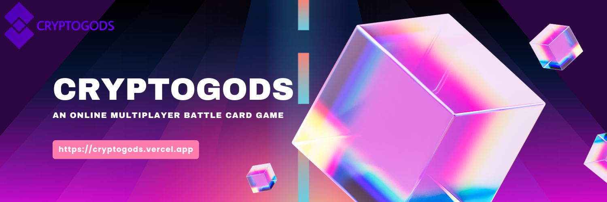

# cryptogods-project

## Building this Web3 project is a way for me to learn and absorb as much information as possible about combining ReactJS with Solidity and Web3 to create beautiful and innovative blockchain applications.

This is an online full-stack Web3 multiplayer battle card game. You will be able to create your character name, create battles, and even join existing battles. You will be able to choose your battleground, battle other players in real time, and even play with friends all across the world.

---

 
<h2>View <a href="https://cryptogods.vercel.app" target="_blank"><strong>Demo</strong></a></h2>
 

---

<h1><a href="https://cryptogods.vercel.app" target="_blank"><strong>CRYPTOGODS</strong></a></h1>

 
